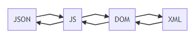

# AlterJX
A modern JavaScript plugin written in ECMAScript 2015 (ES6) to convert JSON, JS, DOM and XML data to each other. An example usage which coverts an XML file to JSON file can be seen as this:
```javascript
var alterJX = new AlterJX();
alterJX.toJSON(myXMLString);
```

## Public Fields and Methods
You can use 4 methods to convert data by specifying the target data type. You do not need to specify the type of the source data, AlterJX will automatically detect it. The 4 public methods are:
* toJSON(source) - Converts source file to a JSON string
* toJS(source) - Converts source file to a JavaScript object
* toDOM(source) - Converts source file to a DOM object
* toXML(source) - Converts source file to an XML string

The indent space size can be entered as a parameter to object constructor. If not specified, the default value of 2 will be used. You can also get and set the indent space size after an object is initialized by reading or changing ```indentSize``` field of the object.


## Work under the hood

AlterJX automatically detects the type of the source data. Then it converts the data to a desired type step by step. For example, to turn a JSON string to XML string; AlterJX turns the JSON string to JavaScript object first. Then turns that JavaScript object to DOM element and finally turns it to an XML string.



## License
This project is [public domain CC0](https://creativecommons.org/publicdomain/zero/1.0/) licensed; therefore, you can copy, modify, distribute and use it, even for commercial purposes, without asking any permission.
